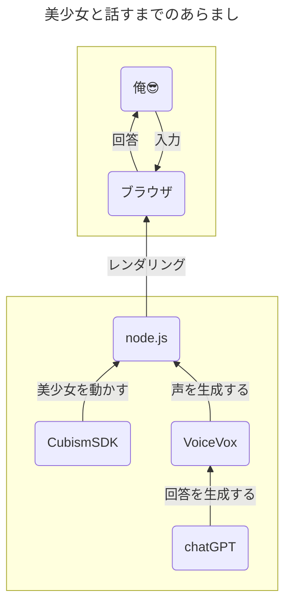

# 構想

1. マイク入力、またはキーボード入力で会話する
1. ChatGPT経由で回答を生成する
1. 生成した回答をVoicevoxで音声に起こす
1. 音声データをLive2Dと一緒に再生する

# 概要図

```mermaid

---
title : 美少女と話すまでのあらまし
---

flowchart BT

    VoiceVox(VoiceVox)
    CubismSDK(CubismSDK)
    nodejs(node.js)
    chatGPT(chatGPT)
    browser(ブラウザ)
    user("俺😎")

    subgraph  
        user --> |入力| browser
        browser --> |回答| user
    end

    subgraph  
        nodejs --> |レンダリング| browser
        CubismSDK --> |美少女を動かす| nodejs
        VoiceVox -->  |声を生成する| nodejs
        chatGPT --> |回答を生成する| VoiceVox
    end
```