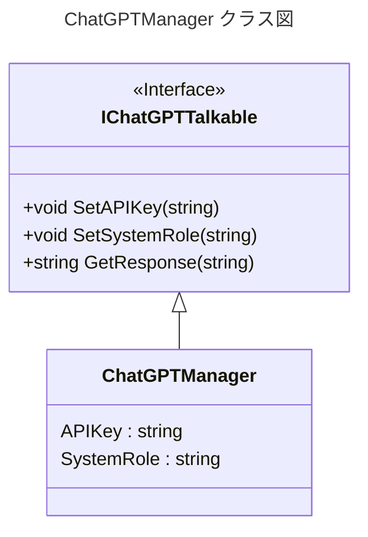

# 概要

ChatGPTへの入力・応答をすべてなんとかするクラス。

- 入力に対して応答するのみ
- キャラクター設定をプロパティで公開
- 過去会話を覚えておく機能は後回しにする
- ストリーミングも後回しにする

```mermaid
---
title : ChatGPTManager クラス図
---

classDiagram
    

    class IChatGPTTalkable {
        <<Interface>>
        +void SetAPIKey(string)
        +void SetSystemRole(string)
        +string GetResponse(string)
    }

    class ChatGPTManager {
        APIKey : string
        SystemRole : string
    }

    IChatGPTTalkable <|-- ChatGPTManager

```