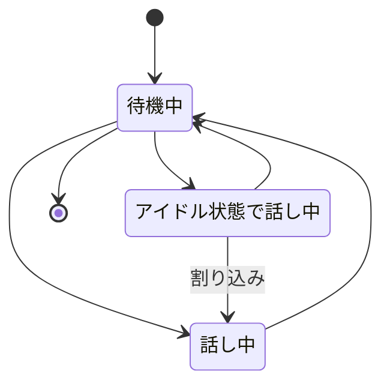

# Live2D制御概要

- 指定した感情に応じて表情を変更する
    - 嬉しい
    - 悲しい
    - 怒り
- wav音声に応じてリップシンクする
- アイドル状態が続いたらなにか適当に独り言を言う
- 待機モーションと話中モーションを交互に遷移する

# 状態遷移図

# 遷移条件

## 待機中→話し中

ChatGPTからの返答をwavに変換できた時

## 話し中→待機中

返答の再生が完了した時

## 待機中→アイドル状態で話し中

一定時間が経過した時

# 要調査

- Unity標準のAnimatorと、Cubism Motion Controllerはどっち使えばいいの？