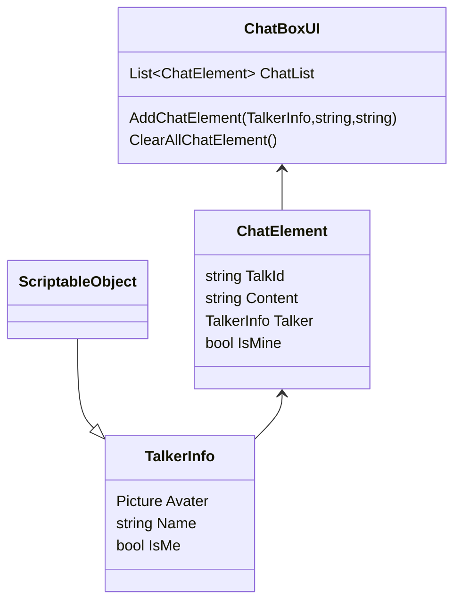

# 概要

会話内容をライン風UIで表示する。

# UI部分

## 全体

- 垂直スクロールボックス内に、一定の高さを持つチャット要素を追加していく
- ボックス下部に、テキスト入力欄・送信ボタンを配置する

## チャット要素

- アバター画像・会話内容を表示する
- 吹き出し風の背景にする
    - 改行にどうやって対応する？

```mermaid

classDiagram
    class ScriptableObject {
    }

    class TalkerInfo {
        Picture Avater
        string Name
        bool IsMe
    }

    class ChatElement {
        string TalkId
        string Content
        TalkerInfo Talker
        bool IsMine
    }

    class ChatBoxUI {
        List~ChatElement~ ChatList
        AddChatElement(TalkerInfo,string,string)
        ClearAllChatElement()
    }

    ScriptableObject --|> TalkerInfo
    ChatElement <-- TalkerInfo
    ChatBoxUI <-- ChatElement

```