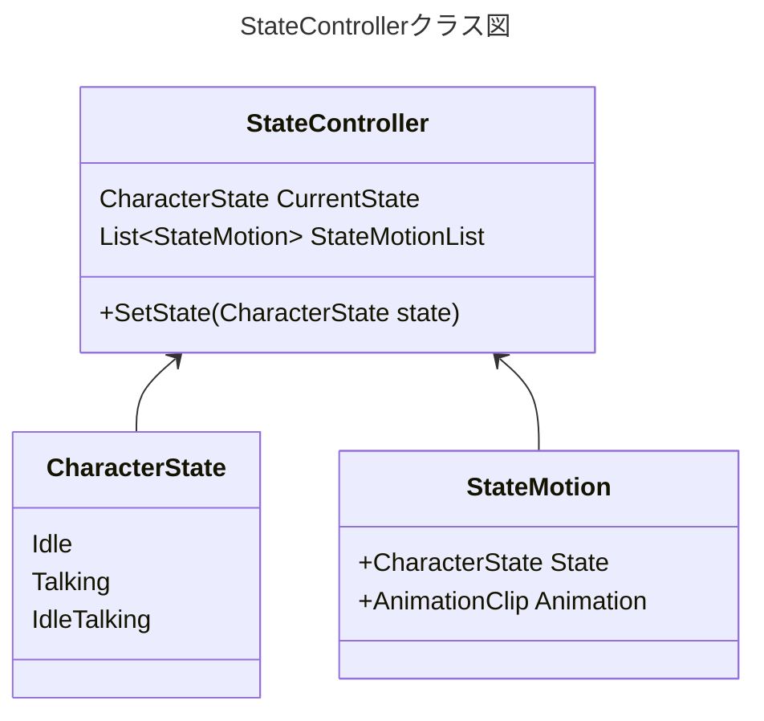

# モーション制御

## クラスの責務

ステートに応じたアニメーションを呼び出すこと

- `SetState()`で設定したステートに遷移する
- 遷移時に、対象のアニメーションを再生する
- アニメーションはフェードありの無限ループにする
- `SetState()`の呼び出しを管理するのは別に分ける
    - ステート遷移に関するロジックも絡んでくるのでまとめるとヤバい

# 確認事項

- `List<StateMotionList>`はどこで宣言する？
    - コンストラクタで投入する
    - Unity上のエディタで設定できる？Cubismのサンプルだとできそうな感じがある