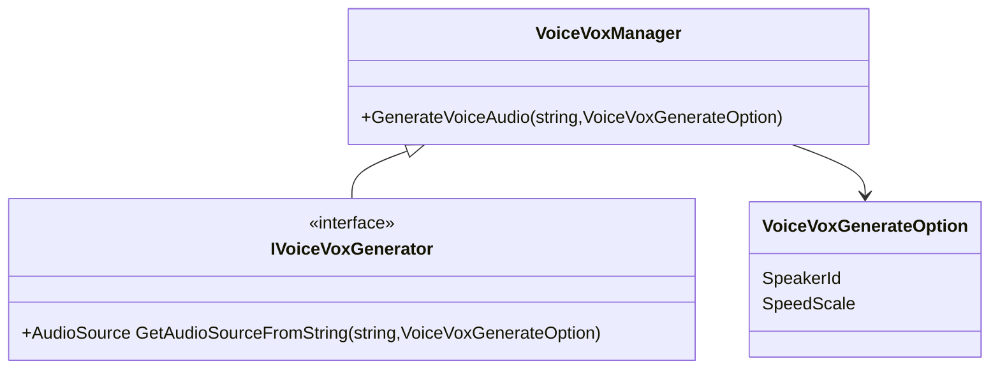

# 概要

- VoiceVoxサーバーにアクセスし、指定文字列の音声を合成する
- 合成した音声を`Audio Source`に設定する
    - 設定したものをキャラクターにリップシンク(`Cubism Audio Mouth Input`)でやる
- `Audio Source`オブジェクトを返す感じにする？

```mermaid

classDiagram

    class IVoiceVoxGenerator {
        <<interface>>
        +AudioSource GetAudioSourceFromString(string,VoiceVoxGenerateOption)
    }
    
    class VoiceVoxGenerateOption {
        SpeakerId
        SpeedScale
    }

    class VoiceVoxManager {
        +GenerateVoiceAudio(string,VoiceVoxGenerateOption)
    }

    VoiceVoxManager <|-- IVoiceVoxGenerator
    VoiceVoxManager --> VoiceVoxGenerateOption

```

