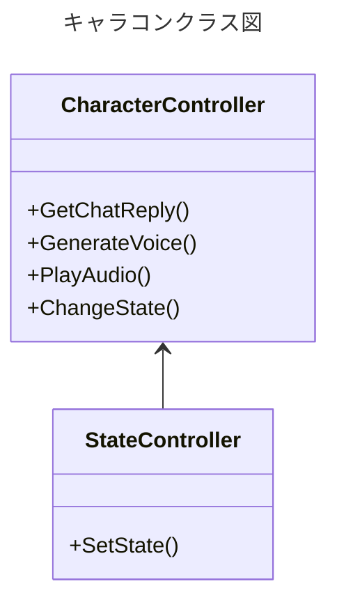

# キャラクター制御

以下の制御・処理が必要

- 入力から返答を取得
- 返答から音声を生成
- キャラクターの制御
    - 音声を再生
    - ステートの遷移 OK

```mermaid
---
title : キャラコンクラス図
---

classDiagram

    class CharacterController {
        +GetChatReply()
        +GenerateVoice()
        +PlayAudio()
        +ChangeState()
    }

    class StateController {
        +SetState()
    }

    CharacterController <-- StateController

```